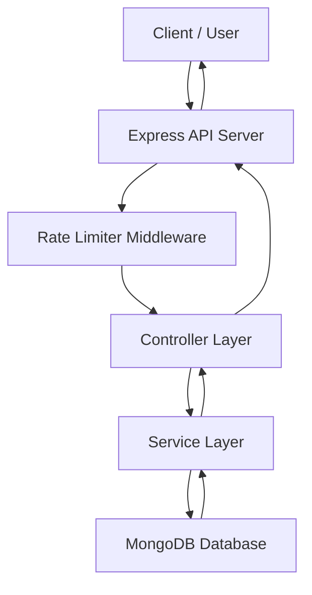

# 🔗 URL Shortener with Click Tracking

## 🧠 Overview

This project is a **backend-focused URL Shortener service** that allows users to convert long URLs into short, shareable links while tracking detailed click analytics.

It is built using **Node.js, Express.js, and MongoDB**, following **RESTful API principles** and a clean **MVC-style architecture**.  
The service supports **URL redirection**, **click tracking**, **rate limiting**, and is fully **Dockerized** for easy deployment.

---

## 🚀 Features

* 🔗 Shorten long URLs into compact short links
* 🔁 Redirect short URLs to original destinations
* 📊 Track total click count and visit timestamps
* 🛡️ Rate limiting to prevent API abuse
* ✅ URL validation and error handling
* ⚡ Fast redirection using MongoDB indexing
* 🧩 Modular MVC-based project structure
* 🐳 Docker & Docker Compose support
* 🔌 Backend-only REST API (Postman / frontend ready)

---

## 🏗️ System Architecture


------------------

## 🔄 System Workflow (Step-by-Step)

### 1. User Request
- User sends a request to shorten a long URL.

### 2. Rate Limiting
- Requests are filtered to prevent abuse.

### 3. URL Validation
- Invalid URLs are rejected safely.

### 4. Short Code Generation
- A unique short code is generated.

### 5. Database Storage
- Original URL, short code, and analytics are stored in MongoDB.

### 6. Redirection
- Short URL redirects to the original URL.

### 7. Click Tracking
- Each redirect updates click count and visit history.

---

## 🛠️ Tech Stack

### **Backend**
- Node.js  
- Express.js  

### **Database**
- MongoDB  
- Mongoose  

### **APIs**
- RESTful APIs  

### **Security & Middleware**
- Express Rate Limit  
- Input Validation  

### **DevOps**
- Docker  
- Docker Compose  

---

## 📂 Project Structure

```text
├── src/
│   ├── controllers/
│   │   └── url.controller.js
│   ├── models/
│   │   └── url.model.js
│   ├── routes/
│   │   └── url.routes.js
│   ├── config/
│   │   ├── connect.js
│   │   └── ratelimiter.js
│   ├── utils/
│   │   └── generateShortCode.js
│   └── app.js
│
├── server.js
├── Dockerfile
├── docker-compose.yml
├── package.json
└── README.md
```
----------------------------
## 🚀 How to Run Locally

### 1️⃣ Clone the Repository
```bash
git clone https://github.com/your-username/url-shortener.git
cd url-shortener
```
### 2️⃣ Install Dependencies
```bash
npm install
```
### 3️⃣ Setup Environment Variables

Create a `.env` file in the root directory:

```env
PORT=5000
MONGO_URI=mongodb://localhost:27017/urlshortener
```

### 4️⃣ Start the Server
```
npm start
```

### 🐳 Run with Docker
```
Build and Run
docker-compose up --build
```

### The API will be available at:
```
http://localhost:5000
```
### 📌 API Endpoints
```
Create Short URL
POST /api/url

Redirect Short URL
GET /:shortCode

Get URL Analytics
GET /api/url/analytics/:shortCode
```
## 📂 Features Summary

- ✅ URL shortening  
- ✅ Redirection handling  
- ✅ Click analytics  
- ✅ Rate limiting  
- ✅ MongoDB indexing  
- ✅ Dockerized deployment  
- ✅ Resume-ready backend project  


